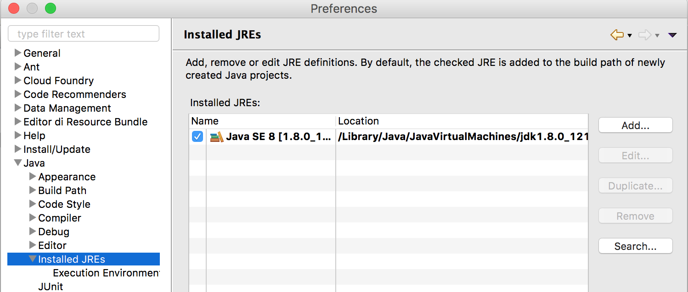
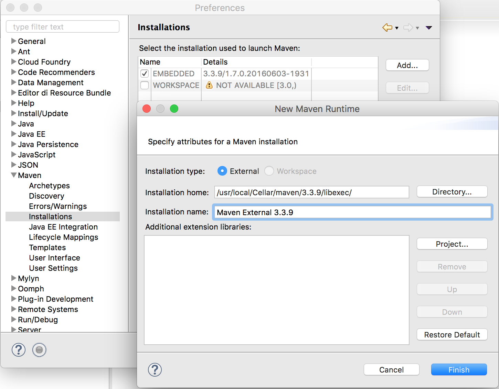

# Install and Check Tools

### Java 8
In this course we will create projects with java 8 version. So if you are using different version of java please download the latest 8 JDK. 
[](http://www.oracle.com/technetwork/java/javase/downloads/jdk8-downloads-2133151.html)

Download package depending on your OS System and install. After that:
  - add JAVA_HOME to environment variables pointing to JDK folder and add to PATH variable
  - open CLI and run command `java -version`
  - check for a positive result, the result must be like following
    ```bash
    java version "1.8.0_121"
    Java(TM) SE Runtime Environment (build 1.8.0_121-b13)
    Java HotSpot(TM) 64-Bit Server VM (build 25.121-b13, mixed mode)
    ```

### Maven
In this course we will use Maven 3+ version to build and handle dependencies. If you haven't please download the latest 3+ stable version.
[](https://maven.apache.org/download.cgi)

If you have OSX you can also install automatically with brew using command `brew install maven`

Download binary package version and unzip inside a folder. After that:
  - add M2_HOME to environment variables pointing to Maven folder and add to PATH variable
  - open CLI and run command `mvn -version`
  - check for a positive result, the result must be like following
    ```bash
    Apache Maven 3.3.9 (bb52d8502b132ec0a5a3f4c09453c07478323dc5; 2015-11-10T17:41:47+01:00)
    Maven home: /usr/local/Cellar/maven/3.3.9/libexec
    Java version: 1.8.0_121, vendor: Oracle Corporation
    Java home: /Library/Java/JavaVirtualMachines/jdk1.8.0_121.jdk/Contents/Home/jre
    Default locale: it_IT, platform encoding: UTF-8
    OS name: "mac os x", version: "10.13.1", arch: "x86_64", family: "mac"
    ```
### Maven settings
Maven `settings.xml` file is inside maven conf folder. Here you can change global configurations and add for example proxy settings. If you want to override global settings you can create inside your local `~/.m2` folder a copy of the global `settings.xml` file and edit this one. 
```xml
<proxy>
    <id>sopra_http</id>
    <active>true</active>
    <protocol>http</protocol>
    <host>miln.proxy.corp.sopra</host>
    <port>8080</port>
    <nonProxyHosts>local.net|some.host.com</nonProxyHosts>
</proxy>
<proxy>
    <id>sopra_https</id>
     <active>true</active>
     <protocol>http</protocol>
     <host>miln.proxy.corp.sopra</host>
     <port>8080</port>
     <nonProxyHosts>local.net|some.host.com</nonProxyHosts>
</proxy>
```
### Tomcat
In this course we will use tomcat 8+ version as container. If you haven't please download the latest 8+ stable version.
[](https://tomcat.apache.org/download-80.cgi)

Download Core binary package version and unzip inside a folder. After that:
  - add setenv.bat or setenv.sh file inside tomcat bin folder with following content to enable remote debugging (use `set` instead of `export in Windows)
    ```sh
    export CATALINA_OPTS="-Xdebug -Xrunjdwp:transport=dt_socket,address=8000,server=y,suspend=n"
    ````
  - on OSX/Unix systems `chmod +x setenv.sh` to give execute permissions to the file  
  - on OSX/Unix systems from tomcat folder launch `chmod -R +x bin` to give execute permissions to tomcat commands
  - open CLI pointing tomcat bin folder and run command `catalina.sh run` or `catalina.bat run`
  - check for a positive result opening browser at http://localhost:8080
    

    
### Postman
In this course we will use postman as tool to make calls to REST services. If you don't have this tool or an equivalent one download and install the latest version.
[](https://www.getpostman.com/)


### IDE
In this course we have to use an IDE with support for Java and Spring like Eclipse, STS, Intellij IDEA, Netbeans, ... You are free to use your favorite IDE.
If you don't have one you can install pivotal Spring Tool Suite.
[](https://spring.io/tools)

Download package depending on your OS System and install. After that:
  - remember to set Proxy into Preferences in case you need
  - remember to set correct JDK under Preferences > Installed JREs
  
  - remember to add your external Maven under Preferences > Maven
  
