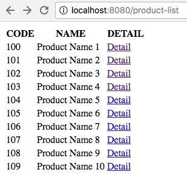
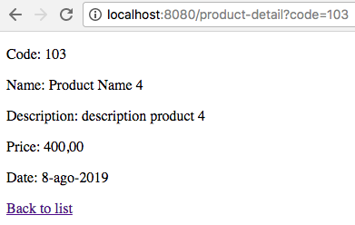

# Learn how to implement a simple web application using JEE features

Download [backend-course_day3.zip](backend-course_day3.zip) file and import into your IDE as maven project.

the structure of the project is 
```txt
├── src
│   └── main
│       ├── java
│       │   └── com
│       │       └── mcs
│       │           └── be
│       │               └── course
│       │                   ├── Main.java
│       │                   ├── productinventory
│       │                   │   ├── Inventory.java
│       │                   │   └── Product.java
│       │                   └── servlets
│       │                       ├── HelloServlet.java
│       │                       ├── ProductDetailServlet.java
│       │                       └── ProductListServlet.java
│       └── webapp
│           ├── index.jsp
│           ├── productDetail.jsp
│           └── productList.jsp

```

The project has a configuration that enable the use of an embedded tomcat, so you can run the project using your IDE.
To run the application launch as a main method inside `Main.java class`. 

Once started you can try the sequent urls:
- http://localhost:8080/
- http://localhost:8080/hello
- http://localhost:8080/hello?key=Matteo


GOAL: Implement everything necessary to see a product list and a product detail page like following.





You can use all libraries you want to help in your development adding them to maven dependencies. 


HINT:
- check the TODO inside JSPs and servlets
- remember the difference between forward and sendRedirect
- use tags instead of scriptlet
- if you complete the exercise try to add also Filter and Listener


